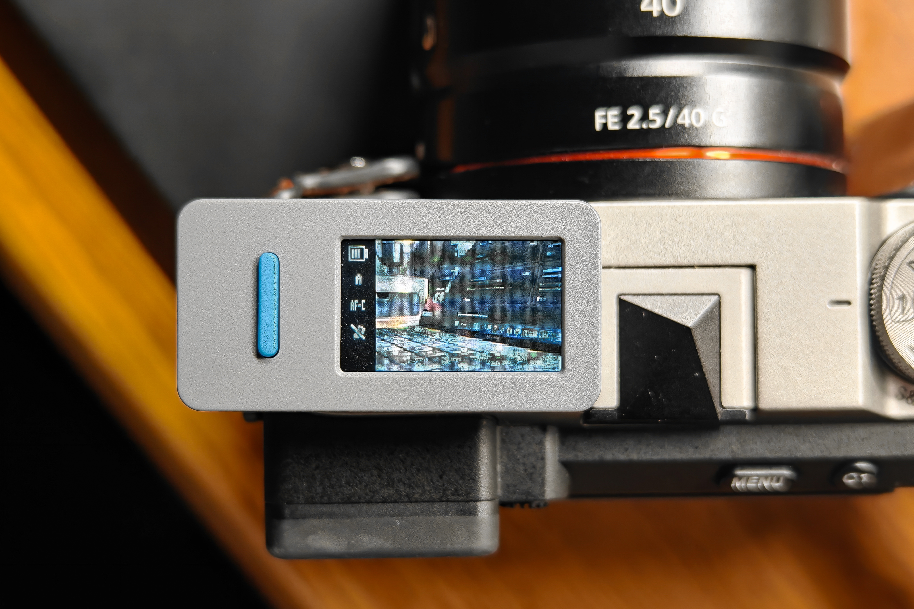

# alpha-buddy

在 **M5Stack StickS3** 上查看 Sony 相机实时画面，并用实体按键遥控拍照。
StickS3 建立 Wi-Fi 热点，相机加入后自动连接，无需手机或路由器。



**当前为预览版，可从 [Releases](https://github.com/R0sin/alpha-buddy/releases/tag/v0.1.0-alpha.1) 下载固件。** 已验证设备为 StickS3 和 Sony α7C II（ILCE-7CM2，固件 2.01），其他型号和版本尚未验证。本次发布包已通过编译和离线检查，尚未完成该包的实机刷写与相机验收。

## 功能

- 无线实时取景与遥控拍照
- 自动对焦、手动对焦模式下拍摄
- 翻转取消拍摄、九宫格辅助构图
- 自动调整画面方向、显示电量与相机状态
- 断线自动重连

## 安装

### 刷入固件包

解压 `alpha-buddy-v0.1.0-alpha.1-sticks3.zip`，用 USB 数据线连接 StickS3，在解压目录打开终端：

```sh
python -m pip install esptool==4.9.0
python -m serial.tools.list_ports
python -m esptool --chip esp32s3 --port COM9 --baud 460800 write_flash 0x0 alpha-buddy-v0.1.0-alpha.1-sticks3-full.bin
```

将 `COM9` 替换为实际端口。若无法连接，接上 USB 后长按侧面复位按钮，直到内部绿灯闪烁，再重试。
刷写完成后按复位键或重新上电。完整镜像会重置热点密码和九宫格设置，请使用屏幕显示的新密码连接相机。

### 从源码安装

安装 [PlatformIO](https://platformio.org/install)，用数据线连接 StickS3，在项目根目录运行：

```sh
pio run -e m5stack-sticks3
pio device list
pio run -e m5stack-sticks3 --target upload --upload-port COM9
```

将 `COM9` 替换为设备实际端口。若无法烧录，接上 USB 后长按侧面复位按钮，直到内部绿灯闪烁，再重试。

## 首次连接

以下路径对应 α7C II 中文菜单。开始前请断开相机与智能手机的连接。

1. 启动 StickS3，查看屏幕上的热点名称 `alpha-buddy` 和 8 位密码。
2. 在 `MENU → 网络 → Wi-Fi → Wi-Fi连接` 中选择“开”；再进入 `MENU → 网络 → Wi-Fi → 访问点手动设置`，选择 `alpha-buddy` 并输入密码。
3. 在 `MENU → 网络 → 连接/电脑遥控 → 电脑遥控功能 → 电脑遥控` 中选择“开”。
4. 在 `MENU → 网络 → 网络选项 → 访问身份验证设置 → 访问身份验证` 中选择“关”。
5. 进入 `MENU → 网络 → 连接/电脑遥控 → 电脑遥控功能 → 配对`，确认设备 `alpha-buddy`。
6. 在 `MENU → 网络 → 连接/电脑遥控 → 遥控拍摄设置 → 静态影像保存目的地` 中选择“仅拍摄装置”（`Camera Only`）。

菜单参考 Sony 官方[电脑遥控说明](https://helpguide.sony.net/ilc/2360/v1/zh-cn/contents/0903_pc_remote_function.html)、[访问身份验证设置](https://helpguide.sony.net/ilc/2360/v1/zh-cn/contents/221h_access_authentication_settings.html)和[遥控拍摄设置](https://helpguide.sony.net/ilc/2360/v1/zh-cn/contents/201h_remote_shoot_setting.html)。

完成后，开启设备和相机即可等待自动连接。密码保存在设备上，重启不会改变；全片擦除后会生成新密码，需要在相机上更新。

## 操作

| 操作 | 功能 |
| --- | --- |
| 按下 Button A | 准备拍摄；自动对焦模式下启动对焦 |
| 松开 Button A | 拍摄 |
| 按住 A，翻到相反横屏方向并保持超过 1 秒 | 出现黄色划线相机图标后，松开取消本次拍摄 |
| 双击侧键 Button B | 开关九宫格，重启后保留设置 |
| 翻转设备 | 自动调整画面方向 |

侧栏显示电量、曝光模式、对焦模式、静音设置和连接状态。灰色 `?` 表示状态暂不可用，相机加感叹号表示取景暂时没有更新。

## 使用提示

- 仅电池供电时，连续五分钟未连接相机会自动关机；等待时按 A/B 可延长等待时间。
- 照片保存在相机中；取景画质不影响照片质量设置。
- 绿色拍摄反馈表示命令被接受，请以相机实际保存结果为准。
- 预览版尚未完成全部拍摄和断线恢复场景验证。

## 许可证

[MIT License](LICENSE) · Copyright (c) 2026 R0sin

感谢 Alpha-Fairy、JPEGDEC、M5Unified 和 M5GFX，详见[第三方声明](THIRD_PARTY_NOTICES.md)。
本项目是社区项目，不代表 Sony 或 M5Stack 官方固件。
